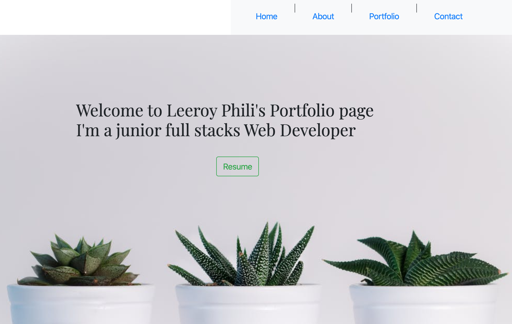

Web link: https://leeroyp.github.io/PortfolioUpdate.github.io/

# Unit 16 Project 2 Homework: Professional Materials

### Development 
1.This is my updated portfolio.  In this assingment i tried to showcase as many skills as i have acquired to display in my portfolio. 

2.First step was to design a simple UI that couldn't be too complicated, I mostly used HTML , with some help of javascript I was able to get some very smooth scrolling addded to the html 

3.I applied the used of Bootstrap and CSS to add some styling and color that would bring the page to life 

4.In the home page I used buttons from Bootstrap to link with the scrolling pages so the user can simplie go to the desired page with a simple click

5.We followed the home page with an about me page. This page provides a briefing about my journey so far as a web developer. Some of the stuff that can be found on this page includes a small bio about me , and some of the of the programs i have had a chance to experience with.

6.Then comes the portfolio page, here we diplayed some of my favourite assignments that I have worked on so far . Using bootstrap modals, we were able to have a clean page highlighting some my favourite projects.  Users can simple click the learn more from each project to read more and have the option to visit the webpage or vist my github paage for a the code 

7.Finally visitors can simple connect to me via linkndin , github , email or through phone with each info provided on the page with links to github and linkndin

### Powered with 
 
HTML
JAVASCRIPT
CSS
BOOTSTRAP

